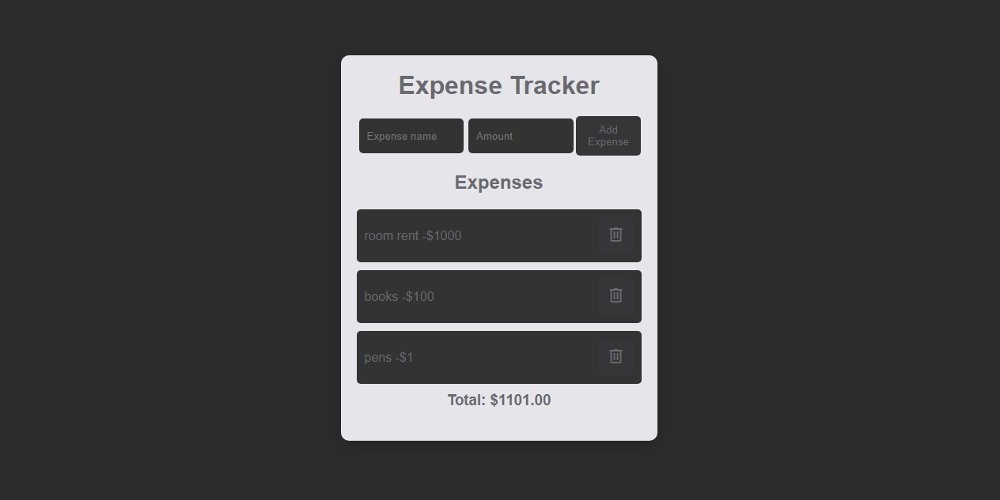
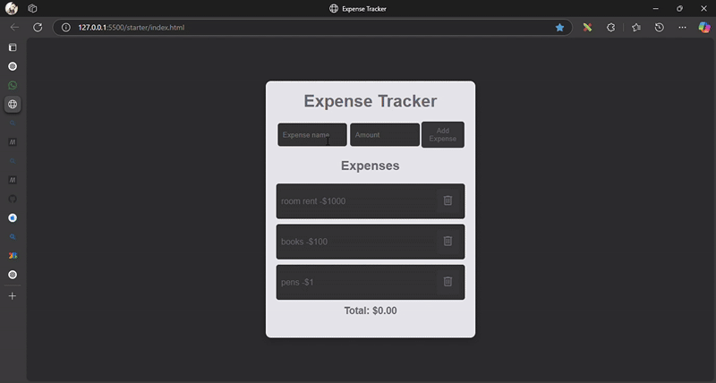

# 💸 Expense Tracker – Browser Extension

An elegant, minimal, and **draggable browser widget** to help you **track expenses**, **stay on budget**, and keep your financial goals on track — all within your browser tab!

---

## 🚀 Features

- ✅ **Real-time expense tracking**
- 🧲 **Draggable widget** – place it anywhere on your screen
- 🌗 **Dark theme** – modern and easy on the eyes
- 🧠 **Color-adaptive UI** – auto-adjusts based on screen position
- 🔒 **Secure local storage** – your data stays on your device
- ⚡ **Lightweight and fast** – no performance lag

---

## 🛠️ Tech Stack

| Tech        | Purpose                           |
|-------------|-----------------------------------|
|  HTML5 | Markup and layout                |
|  CSS3 | Styling and responsiveness       |
|  JavaScript | Core functionality and interactivity |
|  Chrome Extension API | Browser integration              |
|  LocalStorage | Persistent data saving            |

---

## 📦 Installation

1. Clone or [Download this repository](https://github.com/Kishan-shr/Expense-Tracker-Browser-Extension/archive/refs/heads/main.zip)
2. Go to `chrome://extensions/` in your Chrome browser
3. Enable **Developer Mode** (top right)
4. Click **Load unpacked**
5. Select the `Expense-Tracker-Browser-Extension` folder

That’s it — the tracker will now be available in your extension tray!

---

## 📸 Screenshots

> Add your screenshots in the `/assets` folder and update these paths accordingly:

| Light/Dark UI | Draggable Widget |
|---------------|------------------|
|  

---

## 🧩 Future Improvements

- 📊 Visual expense analytics (bar/pie charts)
- 🔔 Budget threshold alerts
- ☁️ Optional cloud sync
- 🌍 Multi-browser support (Firefox, Edge)

---

## 🤝 Contribute

Want to improve or extend the project?

- 🐞 Report bugs via [Issues](https://github.com/Kishan-shr/Expense-Tracker-Browser-Extension/issues)
- 🔧 Fork this repo and submit a pull request
- 🎨 Suggest new UI ideas or features

---

## 📄 License

This project is open-sourced under the [MIT License](LICENSE).

---

## 🙋‍♂️ Author

## Author
Developed with ❤️ by KISHAN SHARMA
linkedin : https://www.linkedin.com/in/kishanshr/

---

> ⭐ If you found this extension helpful, please consider giving it a star!
